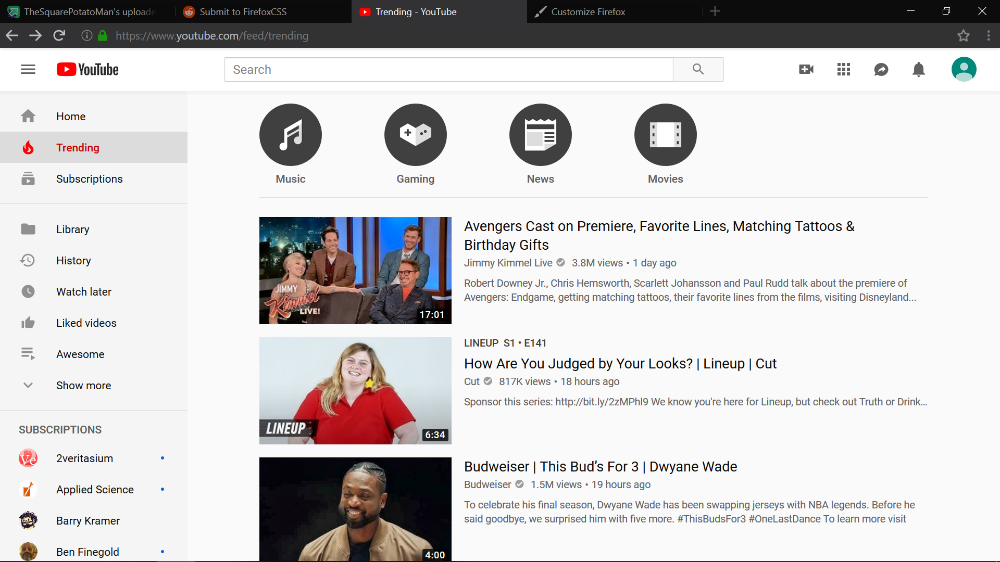
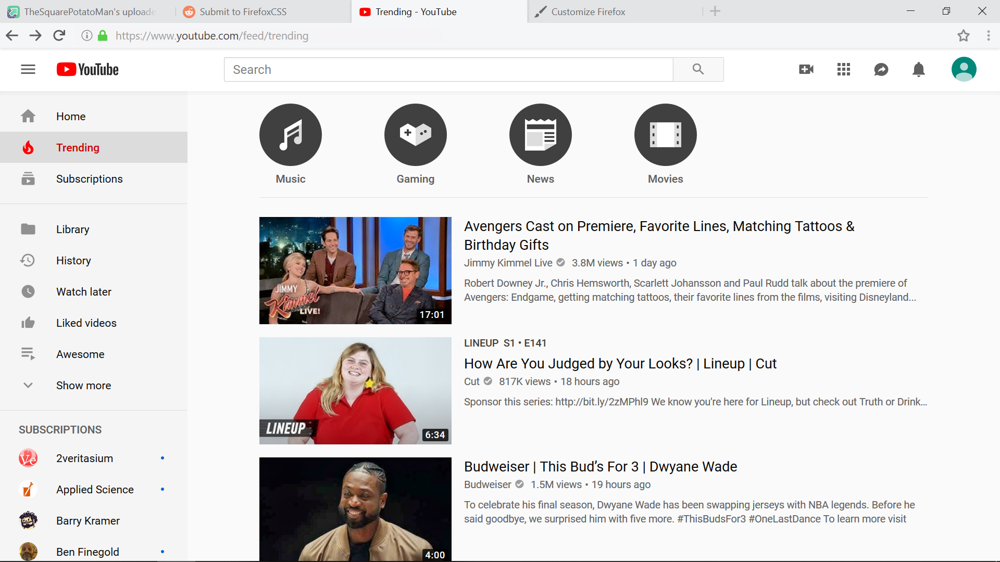

# MaterialFire

Dark mode

 Light mode

*Note: Tested with Firefox 66 on Windows 10
*sporadically glitches so that the navbar becomes unresponsive to mouse hovers or clicks.

### How to apply
+ In Firefox search for your profile (about:profiles).  
+ Under the root directory click Open Directory.  
+ Copy the chrome folder to that path.  
