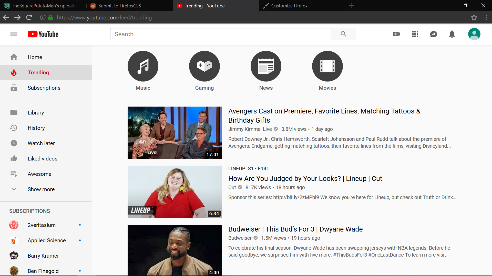
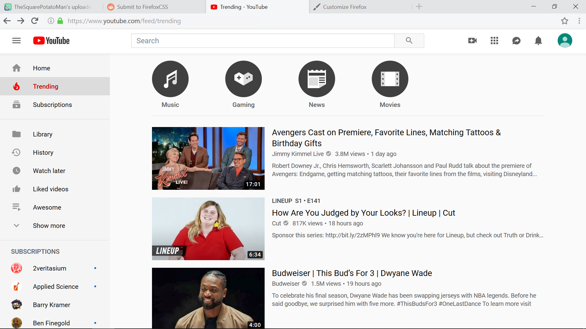

# MaterialFire
+ Removes scrollbar, menu button, page action button and full screen notification
+ Overflow button is used as a 'replacement' for the menu button
+ Replaces overflow, new tab and close-tab icons
+ Edits and adds animations to the tabs, urlbar and all buttons *visible in the screenshots*.

### notes 
Tested with Firefox 66 on Windows 10.
Custom themes will edit this theme's files and some add-ons(at least for the scrollbar) might conflict with it.
Sometimes there's a glitch where the navbar becomes completely unresponsive to mouse hovers and clicks and you will (usually) need to restart Firefox to fix it.

### screenshots:

Dark mode

 
Light mode

### How to apply
+ Type 'about:profiles' in the Firefox urlbar and hit enter
+ Open the root directory folder of your profile
+ Open the 'chrome' folder, or create it if it doesn't exist
+ Copy the file 'chrome.css' and the folder 'material' into the chrome folder
