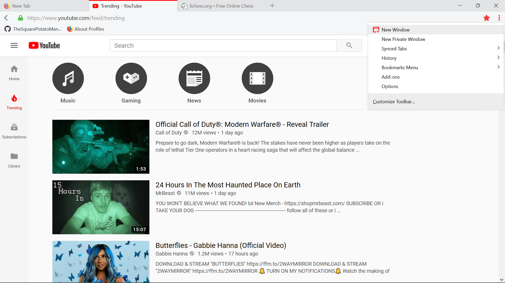

# MaterialFire
+ A clean and (mostly) fluid material UI throughout the interface with efficient autohiding buttons in the navigation bar
+ Edits and adds animations to all tabs, searchbars and buttons 
+ Removable tab line and customizable accent color and animation speeds in the 'variables.css' file
+ Menu button replaced with overflow button, but still available in the overflow menu with the moveablemenubutton.js file

### screenshots

Light mode

Dark mode

Settings menu

### How to apply
+ Type 'about:profiles' in the Firefox urlbar and hit enter
+ Open the root directory folder of your profile
+ Open the 'chrome' folder, or create it if it doesn't exist
+ Copy all files into the chrome folder
+ Restart Firefox

### What I'm hoping to add in the future
+ Vivaldi style adaptive accent color

ps contributions are very much appreciated! :)

